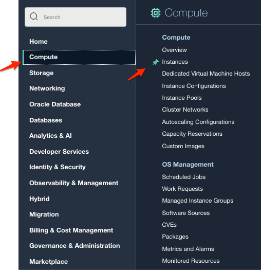
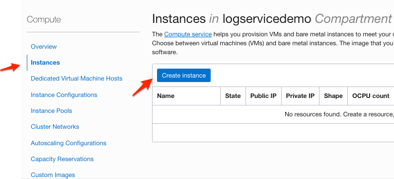
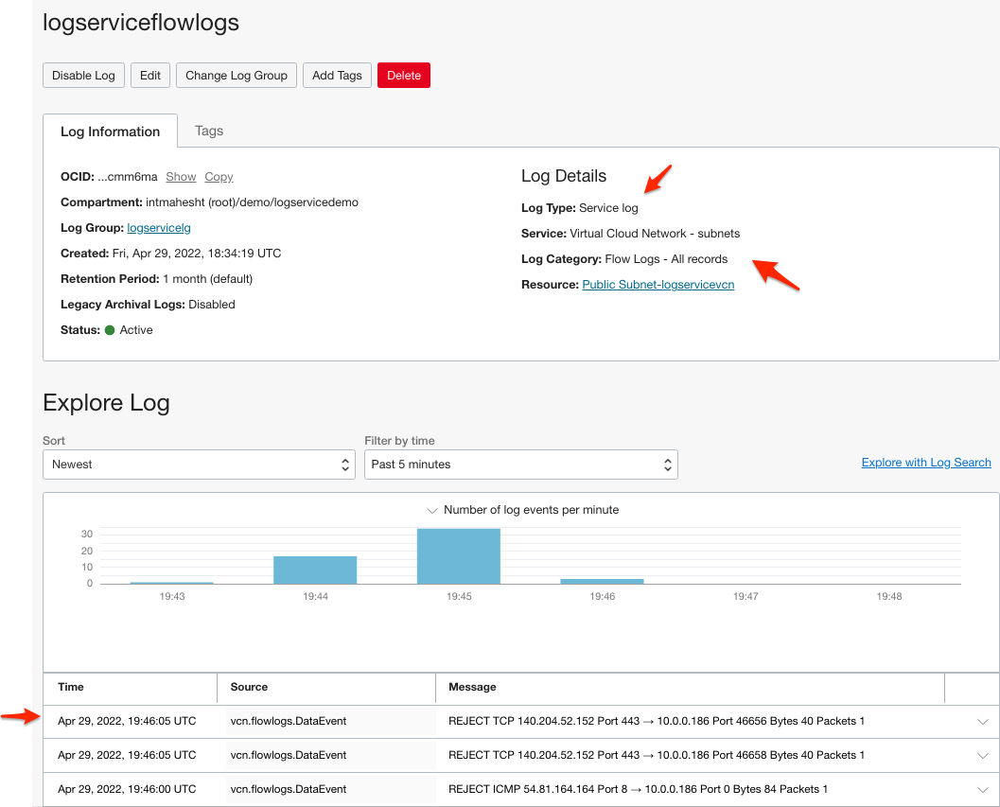

# Data Models

## Introduction

In this Lab you will use the built-in search capabilities of the UI to create a Data Model.

Logging supports a Common Information Model, whereby you can convert any log data you are ingesting 
into a normalized format.

For example, if you were ingesting different types of log data from different servers, the format of 
the log data would also be different. For example, if you had source fields that were the same type of 
field but had slightly different labels, such as "user_name", another called "username", and a 
third "name", you could use the Data Models feature to map these disparate fields to a single, 
common field name ("user").

As a result, after the fields are normalized, you do not need to be concerned which fields are being 
ingested or not, that is, coming in from the input files. You can then run a search based on the 
normalized field names only, to obtain all the results from all the logs. That is, using 
the earlier example, "user", as opposed to the different source field names from the various logs.

Subsequent new input files also get processed according to the same data model input 
format you have defined. You can then run searches based on your data models from 
the main Date Models page, and from the details pages for individual data mappings.

Estimated Lab Time: 25 minutes

### Objectives

In this lab, you will:

* Learn how to extend your search to include logs from multiple regions.

### Prerequisites

* An Oracle Free Tier, Always Free, Paid or LiveLabs Cloud Account
* Access to the cloud environment and resources configured in Lab 1
* The Log Group created in Lab 2 and Custom Log created in Lab 3

## Task 1: Enable Flow Logs

We are going to use VCN Flow Logs as our message log type for this Lab.  Navigate to the
Logs area, then click on 'Enable Service Log':

Enable the 'Virtual Cloud Networks - subnets' Service and select the 'Flow Logs' category.

Use the existing 'logservicelg' Log Group:

## Task 2: Create a Virtual Cloud Network

Now create a 
default Virtual Cloud Network in the current compartment.  Simply follow the
defaults provided by using the Wizard view.

Use the 'Wizard', create a VCN with Internet Connectivity and accept all defaults:

## Task 3: Create a Compute Node

We need some public address bound into the VCN before we will get any Flow Logs.

For this Lab, we will not need to login to the Compute instance.  Indicate that we
are not providing any SSH public keys and press 'Create'.

Wait for a minute or two, and then we should start seeing Flow Logs appearing:

## Task 4: Create a Minimal Data Model 

Navigate to Logging Service / Data Models:

Create a new Data Model:

Data Models can have multiple mappings.  We will add these in a moment.  Create your
Data Model, selecting the option to configure mappings later.  

There are 'Data Mapping Templates' that can be used.  We will get to this in a moment.

## Task 5: Add a Mapping to the Data Model

Let's add a mapping now.  

Once the Data Model is open, create a new mapping:

The following workflow appears.  Name it and then select what the Data mapping applies to.

For this Lab, we will apply it to the Flow Logs we just created.

Now comes the interesting part!  Data Models are a mapping mechanism.  That means
you can take any attribute in your source Logging messages and rename them.  Since messages
are in JSON format, they are often nested deeply.  Data Models allow you to 
pull an attribute up' to the top level.

Here is the basic syntax.  Note the validator link at the bottom right.  Use this to assure
you have a correct syntax.

Save this. 

## Task 6: View Data Model Mapping Results

Without Data Models, A typical Flow Log message looks like this:

Here is a thumbnail of the mapping we have in place.  We are only pulling 'id' and
'type' with our mapping, and renaming them.

### Mapping Behavior
  * id --> identifier
  * type --> kind

Now open your log in Search:

You'll ve in Advanced Query Mode where you can see the Query itself.  The Search syntax is 
a hierarchy separated by '|' showing how it cascades to create this result:

    <compartment>/<CIM data model>/<log group>/<log>

Select one of the flow logs and select the down-arrow to open the detail.  You'll see
that 'id' was replaced by 'identifier' and 'type' was replaced by 'kind'.

Finally, the CIM Data Model excludes any other attributes that you do not directly call out.
That's why these two (plus datetime) are the only attributes you see now.

## Task 7: Pull Up Nested Attributes

If we want to pull up attributes that are nested in the message JSON, simply prefix them
with the JSON containing object.  

### Mapping Behavior
  * data.sourceAddress --> source
  * data.destinationAddress --> dest

Edit your Data Model Mapping and add this mapping behavior:

Here you see these attributes appearing now at the top level of the JSON message.

## Task 8: Use CIM Standard Data Model Templates

The Logging Service provides a number of pre-defined mappings that represent common
attribute names for 3rd party systems.  If you use these, you need to replace each User Expression
with a value that will originate in an OCI Logging message.

When complete, you may proceed to the next Lab.

## Learn More

## Acknowledgements
* **Author** - Carl Downs, Principal Solution Architect, OCI Observability Team
