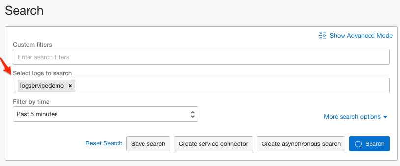
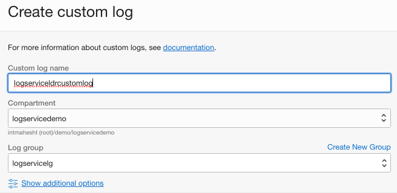
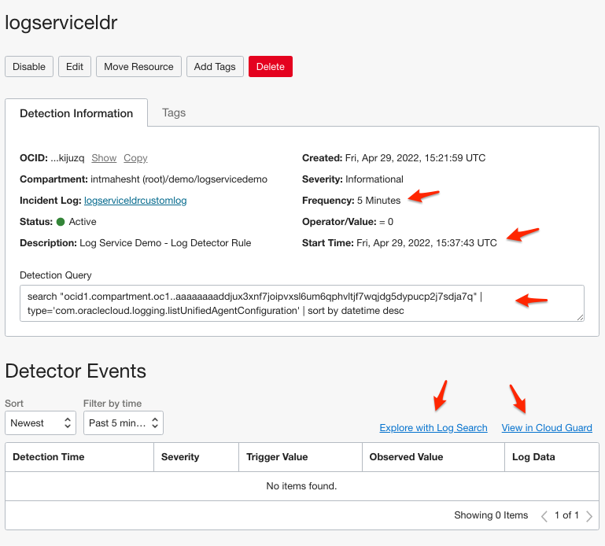

# Log Detector Rules

## Introduction

In this Lab you will use the built-in search capabilities of the UI to create a Log Detector Rule.

Log Detector Rules are Search Queries that you 
can use to detect potential security threats or other conditions of interest. These rules runs continuously 
based on the defined query, sending the output to the specified custom log when a trigger condition is met.

A Log Detector Rule is comprised of the following components:

### Advanced Queries
An advanced query you can either compose from scratch, or one you have already created using the 
Saved Searches on page 86 page.

### Triggers
A trigger condition that runs on a periodic time interval.

### Custom Logs

A custom log where the log detector rule query results are output to. For any logs that meet the trigger condition,
the results can be viewed on the Log Detector Rule detail page, the Search page, or the Log Groups page.
Estimated Lab Time: 15 minutes

### Objectives

In this lab, you will:

* Learn how to leverage Log Detector Rules to detect and alert you to conditions of interest

### Prerequisites

* An Oracle Free Tier, Always Free, Paid or LiveLabs Cloud Account
* Access to the cloud environment and resources configured in Lab 1
* The Log Group created in Lab 2 and Custom Log created in Lab 3

## Task 1: Navigate to the Log Detector Rules Page

Navigate to the **Observability & Management / Logging / Search** section in the OCI Console.  

## Task 2: Decide What Specific Condition We Want to Detect

For the purposes of this demo, we will use an admittedly contrived use case!  But it will show 
you how to find and react to conditions.  Our use case is:

    Detect whenever the list of Unified Agent Configurations is accessed

Ok ... this use case is a bit contrived!  But it will be easy to build and test ... and you can see what it 
does clearly.

Click on Agent Configurations page a few times now.  It does not matter that is empty.  Your action will 
generate Audit log entries reporting that.  We will save it as a Search and then build 
a rule to react when anyone visits that page.

## Task 3: Create a Saved Search

Log Detector Rules can be built by writing a query by hand or by just reusing an existing Saved Search.
Click on Saved Searches and create one.  The default is to search the entire Compartment:

Since we visited the Agent Configurations page, there should be Audit logs present for that.
Find one of the events and click the down-arrow to see the message body:

We want to capture the 'type' value.  Find it near the bottom, click it to 'copy value'.

At the top of the page, there is a 'custom filters' input.  Click in it, and paste the value you 
copied as follows.  Note that the value you copied will carry double quotes.  **You must replace double-quotes
with single-quotes**.  Once you have that in the input box, hit enter.

#### Wrong Way:

    type = '"com.oraclecloud.logging.listUnifiedAgentConfiguration"'

#### Right Way:

    type = 'com.oraclecloud.logging.listUnifiedAgentConfiguration'

The 'Filters' area now shows your query phrase.  The Search will immediately start filtering by this type.  
You should not see **only** 'listUnifiedAgentConfiguration succeeded' events.  If aren't seeing any, select
'Today' for filter time or whatever is necessary to widen the time frame as needed.

Click 'Save Search' calling it logdemoagentconfigaudit:

Start the Saved Search workflow.

## Task 4: Create a Log Detector Rule

Make sure you are within the correct Compartment.  Start the workflow to Create a Log Detector Rule:

The top section of the form is asking for normal name, description and containing Compartment for 
the Rule.  Remediation recommendation is optional:

Set the Detector Rule Query so that it uses our Saved Search:

Configure the Trigger Condition.  This is essentially a schedule for how often the Detector Rule will run.
We are going to:
* Run the Detector Rule every 5 minutes
* Trigger on a single match (= 1) is present 
* Report this as 'Informational' severity
* Start detecting immediately

The Rule outputs to a Custom Log. Since we have not created one for this purpose, do so now:

The workflow returns us to the Log Detector Rule wizard with the new Custom Log:

You have the option of creating a downstream Service Connector Hub.  We can easily add one later.
Skip this step for now:

Your new detector is in the list:

Click on the Log Detector Rule to review it's settings. 

## Task 5: Test Your Log Detector Rule

### Problem Report

    Seeing an issue currently - pending review with Harsh

## Task 6: Send Notifications When the Log Detector Rule is Triggered

### Problem Report

    Seeing an issue currently - pending review with Harsh
    

### Problem Report

    Thw LDR seems to never actually run
    If one edits the LDR it shows deferred execution to Tomorrow even when I pick 'immediately'

### Problem Report

    Can't delete an Asynchronous Search?

When complete, you may proceed to the next Lab.

## Learn More

## Acknowledgements
* **Author** - Carl Downs, Principal Solution Architect, OCI Observability Team
