# Asynchronous Searches

## Introduction

In this Lab you will use the built-in search capabilities of the UI to create an Asynchronous Search.

An Asynchronous Search allows you to query logs from a defined time range until the search completes, 
or until the search reaches its maximum time-out limit. After a search completes, the search results 
can be viewed on the Search page, or the Asynchronous Search details page. The Asynchronous Searches 
page allows you to view and manage such asynchronous searches.

Estimated Lab Time: 5 minutes

### Objectives

In this lab, you will:

* Learn how to build and run Asynchronous Searches
* See that Asynchronous Searches can run in the background
* Understand how to view and use the results of an Asynchronous Search

### Prerequisites

* An Oracle Free Tier, Always Free, Paid or LiveLabs Cloud Account
* Access to the cloud environment and resources configured in Lab 1
* The Log Group created in Lab 2 and Custom Log created in Lab 3

## Task 1: Navigate to the Log Service and Create an Asynchronous Search

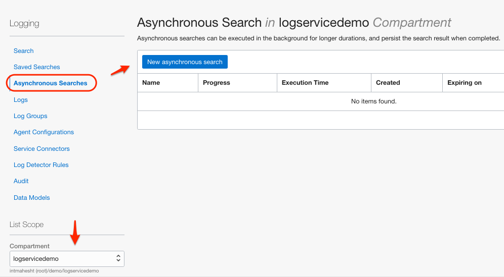  

Click on the button to create a new Asynchronous Search.

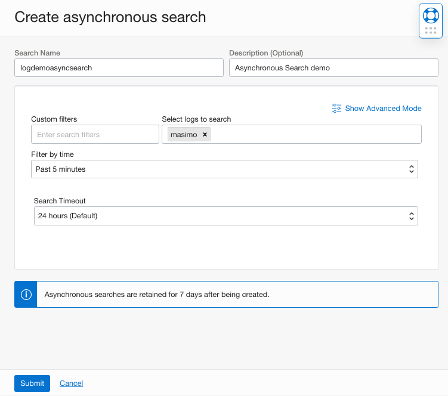  

By default, the basic search interface is displayed, and you can click Show Advanced Mode to create 
an advanced search query. Conversely, while in the Advanced Mode interface, click Switch to Basic Mode 
to revert to the default basic search interface.

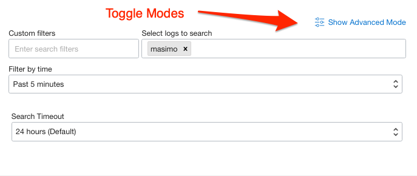  

Note that Advanced Mode gives you a great way to understand Log Search Query Language!
There is also a link in this mode to the syntax documentation at the lower right.

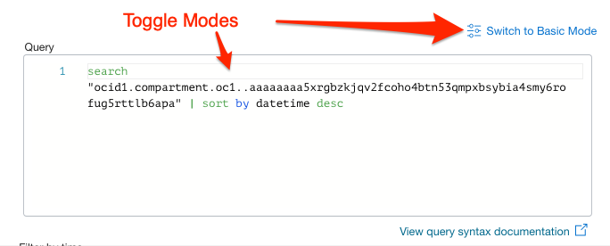  

### Filter

In Filter by time, select a time range from the list:
* Past 5 Minutes
* Past 15 Minutes
* Past hour
* Past 3 hours
* Today
* Custom

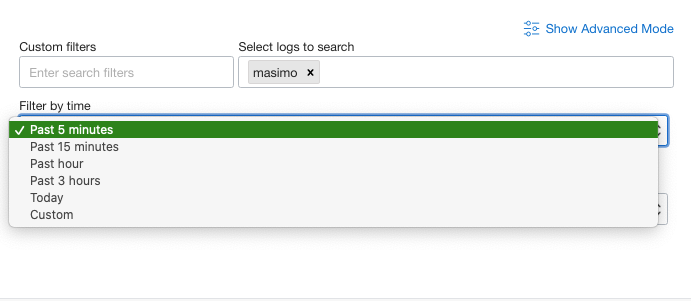 

Select Custom to specify a custom date range in the calendar picker Start Date and End Date fields. 

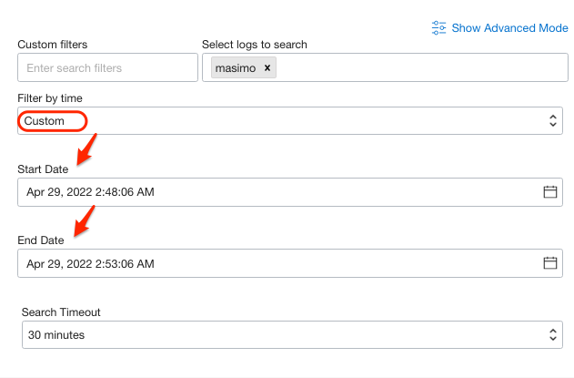 

You can also specify a time value under Time next to the calendar.

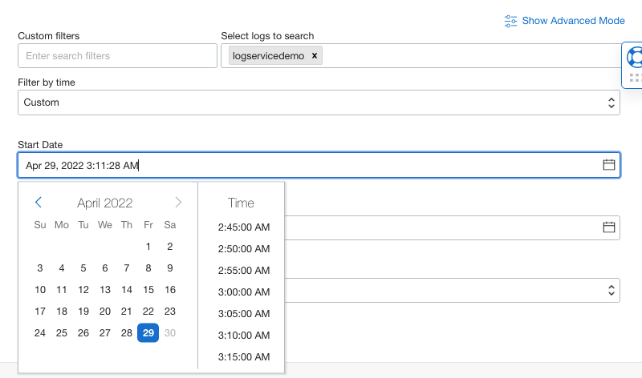 

### Search Timeout
Optionally, in Search Timeout, specify how long the search should run. Select from:
* 30 minutes
*  1 hour
*  2 hours
*  6 hours
*  12 hours
*  24 hours

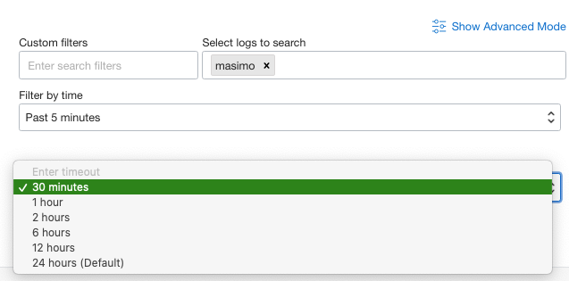 

Click Submit. The asynchronous search will begin to execute in the background:

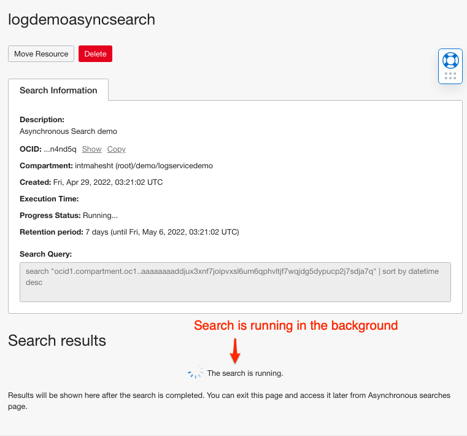 

While that is running, navigate back to the Asynchronous Searches list. Depending on the time
required to run the query, the Asynchronous Search may have already completed, as is shown here:

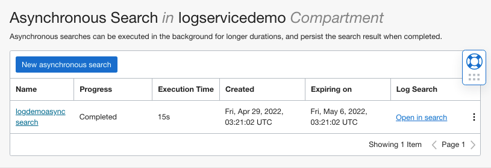 

Here's what the Asynchronous Search list and it's column meanings: 

### Progress 

Displays the asynchronous search state:
* Accepted
* In Progress
* Succeeded
* Failed
* Canceling
* Canceled
* Completed

### Execution Time
The amount of time the asynchronous search has been running.

### Created
The date and time the asynchronous search was created.

### Expiring On
The date and time when the asynchronous search results will be discarded.

### Log Search
If the search has not Completed, or is not available due to a failed or canceled state, 
  only a hyphen (-) is displayed in the column.

## Task 2: Review Asynchronous Search Results

You work with Asynchronous Search results in the same manner as other Logging Searches.

Click on the name 'logdemoasyncsearch' in the list.  

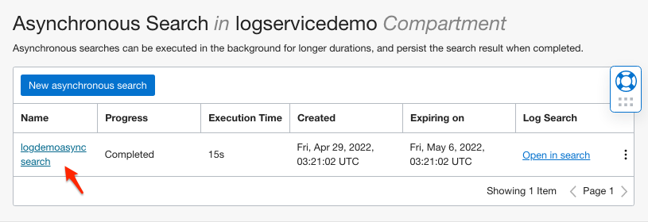 

Search Information is shown including the body of the query. 
Click on 'Explore with Log Search' here to enter Log Search Mode.

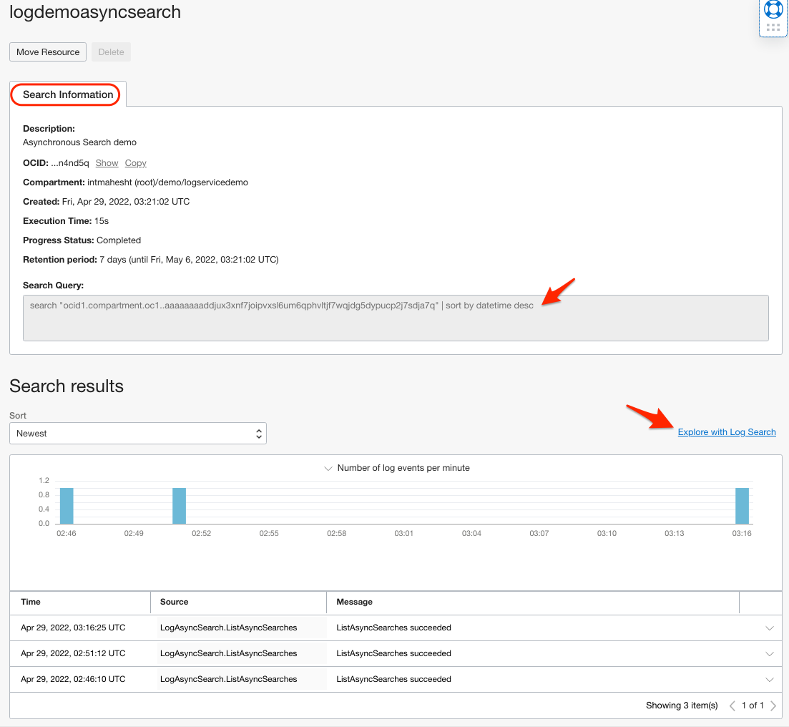 

Search Mode is filtered to the persisted Asynchronous Search object: 

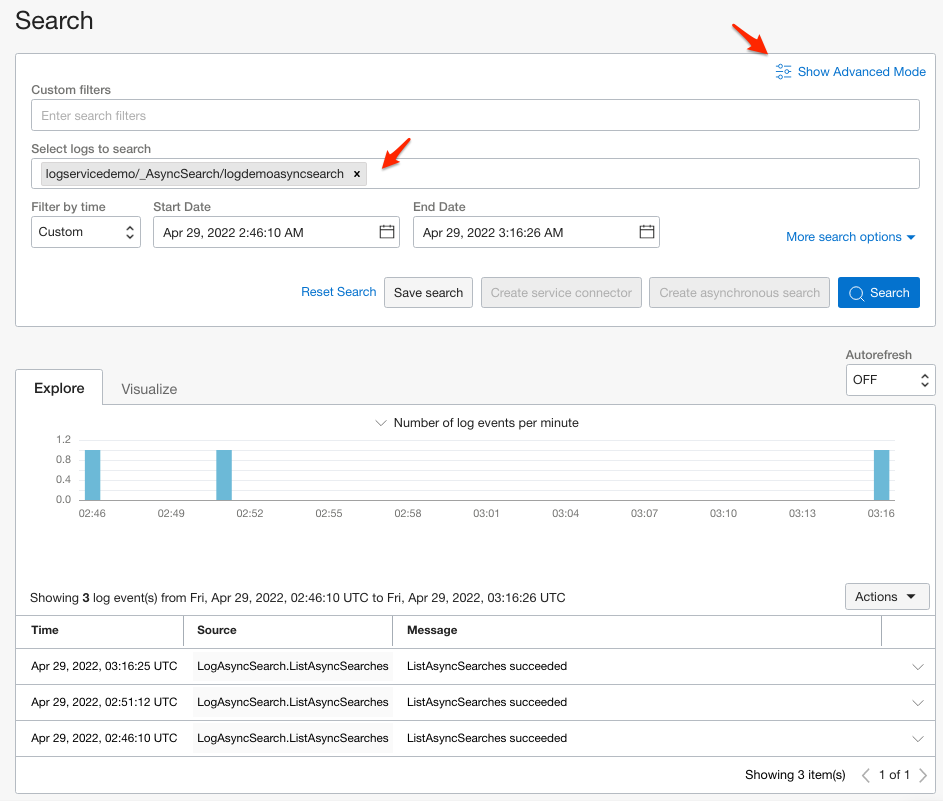 

Advanced mode allows you to see the query and change it:

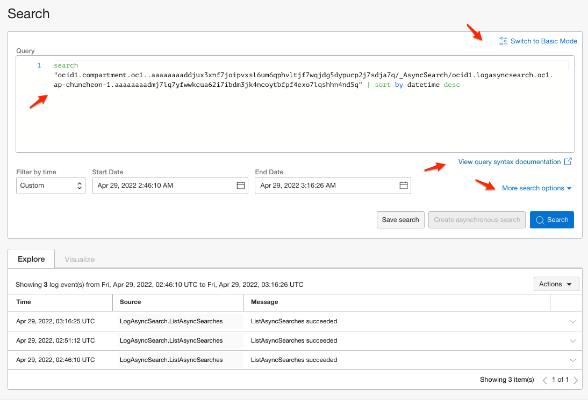 

## Limitations

Note that these Search features are not supported for Asynchronous Searches.  You'll see that
the following buttons and links are disabled:

* Create a Service Connector
* Create another Asynchronous Search from this Asynchronous Search

When complete, you may proceed to the next Lab.

## Learn More

## Acknowledgements
* **Author** - Carl Downs, Principal Solution Architect, OCI Observability Team
