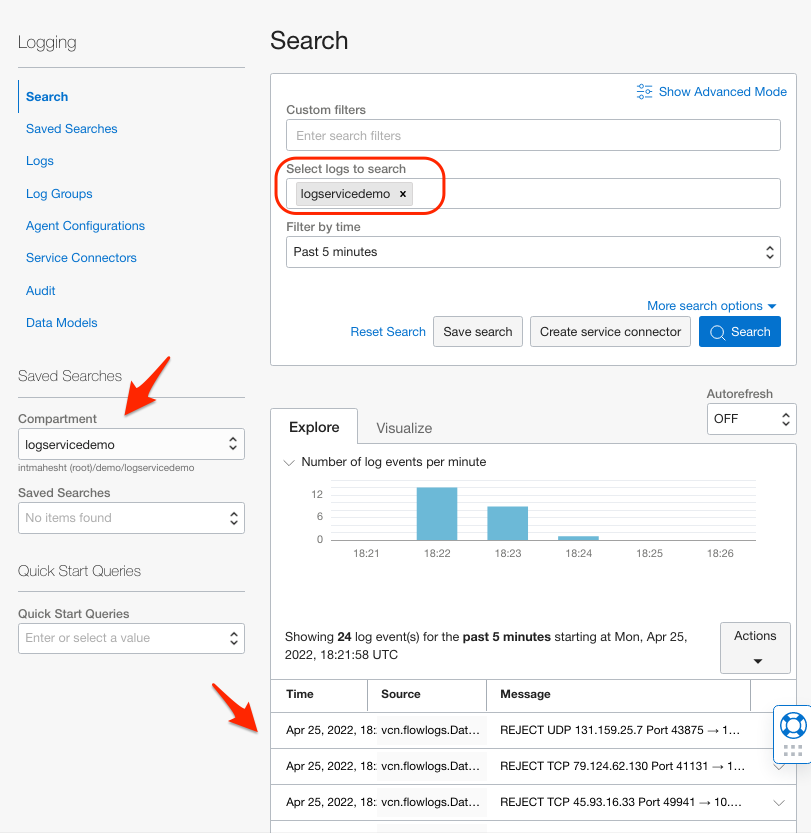

# Searching Across Multiple Regions

## Introduction

In this Lab you will use the built-in search capabilities of the UI to search logs across OCI Regions.

Estimated Lab Time: 5 minutes

### Objectives

In this lab, you will:

* Learn how to extend your search to include logs from multiple regions.

### Prerequisites

* An Oracle Free Tier, Always Free, Paid or LiveLabs Cloud Account
* Access to the cloud environment and resources configured in Lab 1
* The Log Group created in Lab 2 and Custom Log created in Lab 3

### Overview

There are three types of Logs in OCI:
- Service Logs
- Audit Logs
- Custom Logs

We have worked with the first two types of Logs during your previous Lab exercises.  For this Lab, we will explore what the Audit log offers
in the context of searching across OCI regions.

## Task 1: Confirm that your Tenancy is Subscribed to More Than One OCI Region

1. Audit logs are automatically created for each Compartment and in every subscribed 
Region.  We will leverage that behavior to get an aggregated view of the Audit logs across your Tenancy.

2. The OCI Console displays which OCI Region you currently have in scope.  When a Tenancy is provisioned,
one Region becomes the 'Home Region'.

3. Select the Regional Drop-down to switch to an alternate Regional context.  If no additional Regions are subscribed, just
is the Manage Regions option subscribe to another one.  
   

    Note: There is no cost to having additional subscribed Regions 
    if no resources are provisioned there.

4. If you need to subscribe to an additional Region, use the Regional Drop-down and select 'Manage Regions' (at the bottom of the dialog) and subscribe to a second Region.  Once the UI confirms,
you can use the selector to change which Region you are working in.  The Region and Compartment Scope selectors
together define the working area for your activities.

## Task 2: Locate and Search Audit Logs in the Current Region

1. Navigate to the Log Groups for this Compartment.  You will see the 'logservicelg' Log Group from earlier labs as
well as an _Audit Log Group.  Click on the _Audit Log Group which takes you to the Search page.

   

2. You can see from the contents of the logs that the Audit log contain a record for each OCI API call, and whether
the call was successful or not.

3. Click on the Activity Stream tab to see a timeline view of Audit events.

## Task 3: Search Audit Logs Across Multiple Regions

1. Navigate to Search.  The default is to show all logs in the Compartment:

2. You'll see that _Audit, Service and Custom Logs we set up earlier are all inter-mixed in the search results.  
That is because the default filter is Compartment.  
   

3. Click on the 'More Search Options' and click in the input box.  A panel slides out showing a Region selector.  Pick
    the Home Region and another Region.  Click 'Update Regions'.

   

4. In the 'More Search Options' mode, a 'Region' column appears in the search results.  

   

5. If you are not seeing any logs from your second region, try using the Region Selector to change scope 
    over to that region and then click around on the UI.  That will generate _Audit Log entries as it is 
    tracking any API calls made because the Console itself uses the API.

  

## Task 4: Filter Your Search To Include Only Audit Logs

1. Let's filter Search results to show only Audit Log Group.  Click on the "Select Logs to Search" box. A panel 
   slides out which shows the Compartment selected which is why we see all logs.  Click 'x' to clear
    the compartment selection.  Then use the Down Arrow icon to open selections and the '+' icon to add a 
   selection to the filter. 

  

  

  

 

## Task 5: Toggle Which Region(s) _Audit Logs are Displayed

1. In the Explore Tab, just above the results, there is a 'Show/hide regions in results' link. Click it and enable 
or disable whichever region.  You will see the results respond when you 'apply' those changes. 

 

 

## Limitations

This feature does have some limitations at the moment.  You are using a UI / Console feature which
has yet to be incorporated into published OCI API.  For that reason, you will not be able to perform
the following:

- Create a Saved or Asynchronous Search that preserves cross-regional filtering
- Create a Service Connector Hub that understands cross-regional filtering
- Use the Visualize Tab with cross-regional filtering

 

When complete, you may proceed to the next Lab.

## Learn More

## Acknowledgements
* Author - Carl Downs, Principal Solution Architect, OCI Observability Team

